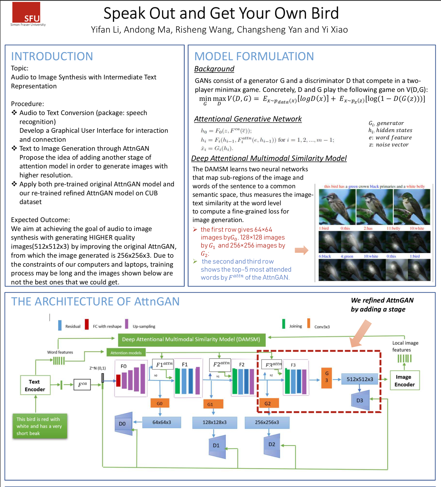
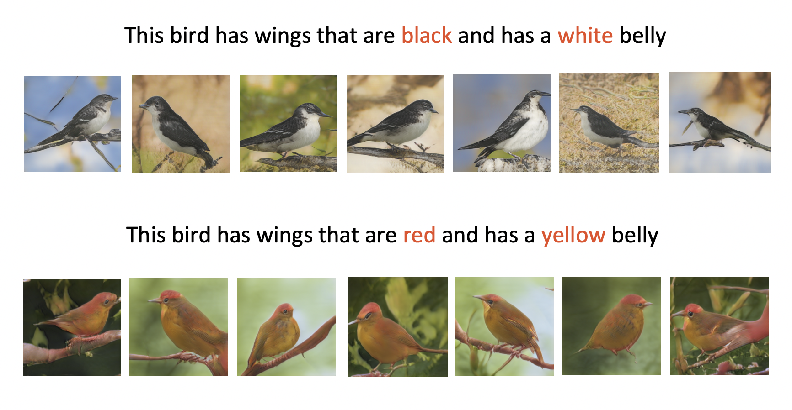
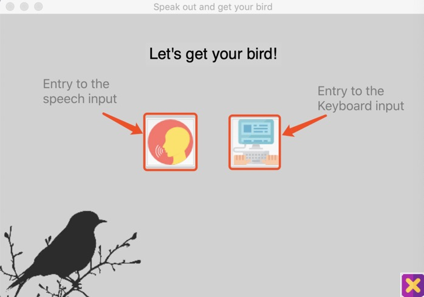
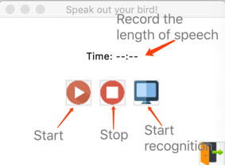
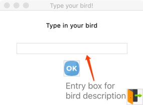
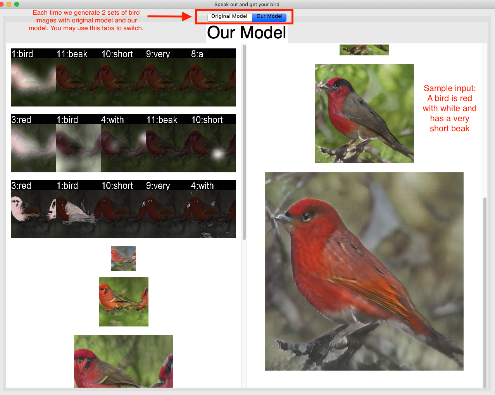

# Speak Out And Get Your Bird -- 2018Fall Final project for CMPT-726

## Introduction

- This is a simple TkInter GUI application that can transform your voice into images.  (Currently only bird supported)
- In this project, we trained a new model that has one more layer than the existing AttnGAN model, which is aim to increase the image resolution with richer details. Specifically, our model is able to generate a bird image with 512\*512 pixels while the existing AttnGAN model with 256\*256 pixels.
- The major purpose of this app is to let users can interact with our new model in a more directly and user-friendly way.
- What we base on is the AttnGAN Model, the Speech Recognition Package and a WAV recording functionality using pyaudio.
	- https://github.com/taoxugit/AttnGAN 
	- https://pypi.org/project/SpeechRecognition/
	- https://gist.github.com/sloria/5693955
- You can also find our most recently trained model at below url.
	- https://drive.google.com/file/d/1J_fgi0HSPFioG-QUuGa1AWk4pJlG7GZX/view?usp=sharing
- Framework

## How to use
### Dependencies
- Please make sure the python version is 2.7 and `pip install` all the following packages.
	- `python-dateutil`
	- `easydict`
	- `pandas`
	- `torchfile`
	- `nltk`
	- `scikit-image`
	- `torch`
	- `pyyaml`
	- `torchvision`
	- `pyaudio`
	
### Samples

### GUI
- Running Command:
	- python ./code/gui.py
- Main Interface

- Voice Input

- Text Input

- Output Birds

## Methodology

### Tkinter

This application is using tkinter GUI frame work. Tkinter is Python’s de-facto standard GUI (Graphical User Interface) package, which is a thin object-oriented layer on top of Tcl/Tk. In this application, all modules are written from origin, using different tkinter widgets to create a simple, straightforward but friendly user interface. It basically consists of following types of widgets:

- **Tk widget**: The main frame widget that constructs the skeleton of this GUI application;

- **Label widget**: they are mainly used to display texture contents such as a title. It is also used to display a background image or a picture. For example, the background image of main panel is built with a label widget;

- **Button widget**: Used to create buttons. Buttons are linked to commands to achieve fundamental functionalities of this application. It works like an event-trigger process, where clicking on the button is the event that triggers linked command, which in turn calls corresponding function;

- **Entry widget**: Used for text input;

- **Canvas widget**: Used to display generated pictures of birds;

- **Scrollbar widget**: Our application will generate pictures with 512 pixels, which could hardly be included in a fixed-size window. Hence, we used scrollbar widget to create vertical scrollbars in case that pictures go beyond the size of window;

- **Toplevel widget**: Used to create sub interfaces and pop-up windows for pictures. It acts like a main frame widget in a way that it is compatible with all widgets that could be placed on the main frame;

- **Notebook widget**: Our application will produce two groups of generated pictures of birds. In avoid of creating too many pop-up windows, we use notebook widget to hold multiple tabs in one window instead of popping multiple windows.

### Speech Recognition

We are aimed at creating a user-friendly interface that also has good human-computer interaction. Instead of letting the application mechanically load pre-entered text and generate pictures, we want to let user make the input. To achieve this goal, speech recognition comes to our view.

Python has its own speech recognition package, which is currently an open source recourse on:  [github.com/Uberi/speech_recognition](https://github.com/Uberi/speech_recognition). It provides very convenient API to access different speech recognition modules, including google speech recognition, google cloud SR, Microsoft speech recognition and so on. It is capable of recording audio input from microphone as well as a saved audio file. It produces results with high accuracy as long as we set reasonable parameters for the recognizer.

In actual use, the background noise could be too large for the recognizer to correctly understand what the user is speaking. We tried multiple energy threshold to filter out noise and adjust input volume of mic. Finally, we achieve satisfying performance with energy threshold of 6000 in the poster session.

### Pyaudio Recording

Python speech recognition does not allow user to determine when to start or stop the recording. It has energy threshold and pause threshold to automatically sense the start and end of a piece of speech. However, that does not meet our requirement, especially when background noise is really large, this mechanism becomes very fragile and unreliable.

To achieve our goal, we find an open source resource on github to enable manually starting and stopping recording:  [gist.github.com/sloria/5693955](https://gist.github.com/sloria/5693955).

This code utilizes Pyaudio to record microphone input and saves to a wav file. Upon this, we let the speech recognizer to read in the saved file and translate the content.
